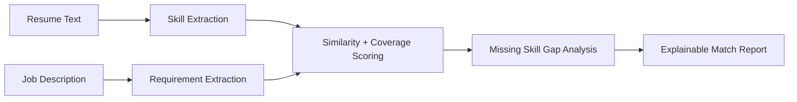

# AI Resume Job Matcher

Resume-to-job matching assistant that extracts skills, compares resumes with
job descriptions, scores alignment, and explains missing skill gaps.

This repository demonstrates a recruiter-friendly AI workflow without storing
private resume data. It uses local sample text and deterministic scoring so it
can run safely without external LLM calls.

## Business Problem

Recruiters and candidates need transparent resume/JD matching beyond keyword
counts. This project demonstrates explainable match scoring, missing-skill
analysis, and recommendation-ready output.

## Architecture



## Quick Start

```bash
python -m src.demo
python -m unittest discover -s tests
docker compose up --build
```

## Included POC Code

- Skill alias extraction for GenAI, RAG, LangGraph, Azure, OCR, and MLOps terms
- Weighted scoring by skill importance instead of simple keyword count
- Category-level match scores and leadership alignment scoring
- Actionable recommendations for missing skills
- Sample resume and job description in `examples/`

## Engineering Maturity

- Dockerfile and `docker-compose.yml` for local execution
- GitHub Actions workflow for unit tests
- `.env.example` for safe configuration hygiene
- Architecture overview in `docs/architecture.md`
- Production readiness notes in `docs/production-readiness.md`
- Security and governance guidance in `docs/security-and-governance.md`
- Privacy, monitoring, cost, scalability, and roadmap considerations documented

## Production Extensions

- Add embedding similarity with sentence-transformers
- Add LLM-based skill normalization
- Add PDF/DOCX parsing
- Add recruiter dashboard or API endpoint
