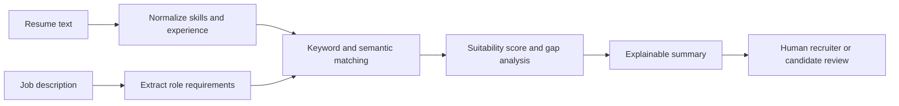

# Architecture Overview

This repository demonstrates a sanitized resume/job-description matching assistant. It is intended for portfolio and interview discussion, not automated hiring decisions.

## Matching Strategy

- Extract skills, tools, years, domains, and role signals.
- Normalize synonyms such as Azure OpenAI, OpenAI, LLM, RAG, LangChain, and LangGraph.
- Combine exact keyword overlap with semantic similarity.
- Report missing skills and evidence behind each score.

## Guardrails

- Keep the result explainable.
- Avoid making a final hiring decision.
- Avoid protected-class inference.
- Treat the score as an advisory signal requiring human review.

## Production Extension Points

- Add FastAPI for a web/API workflow.
- Add vector search for resume/JD libraries.
- Add redaction for candidate contact details.
- Add structured evaluation datasets for scoring regression checks.
